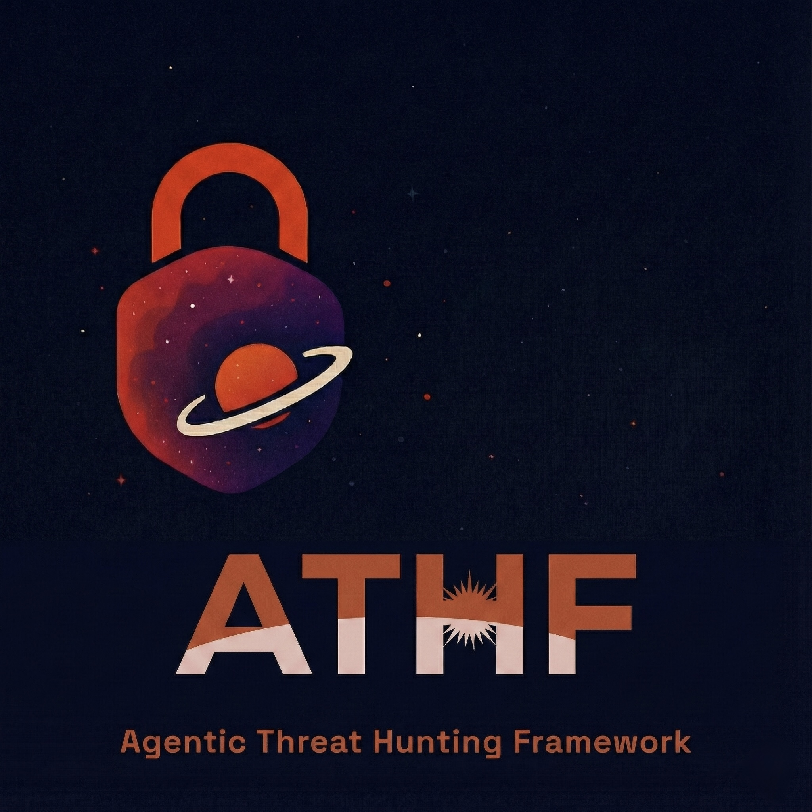
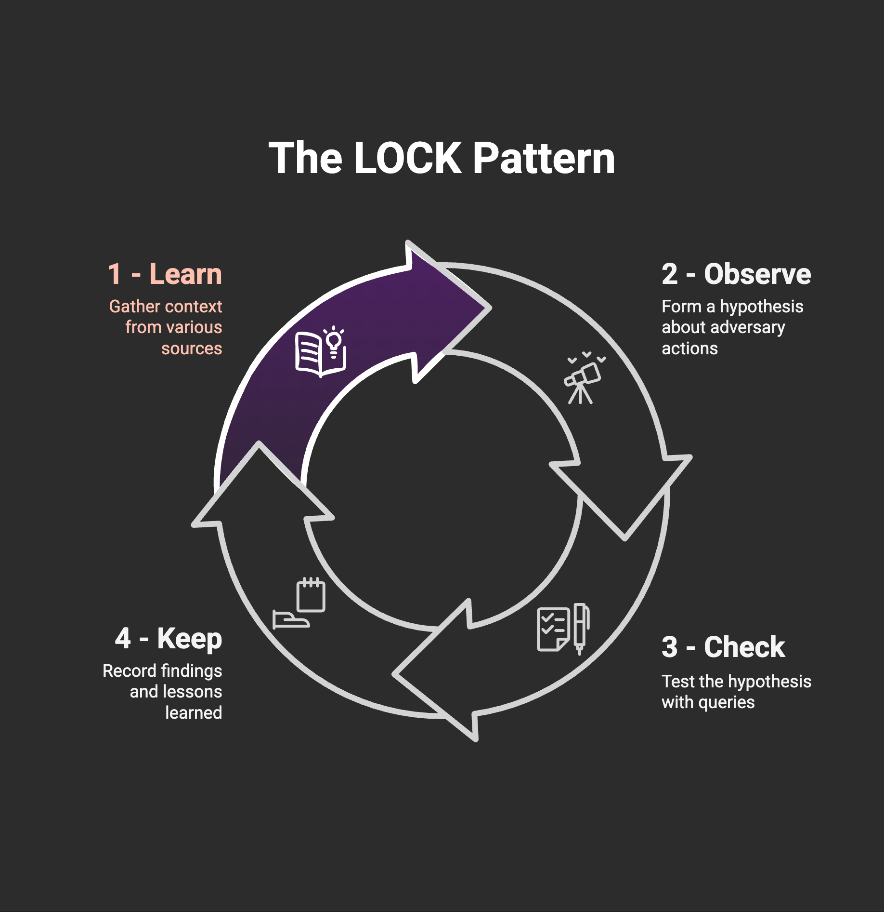
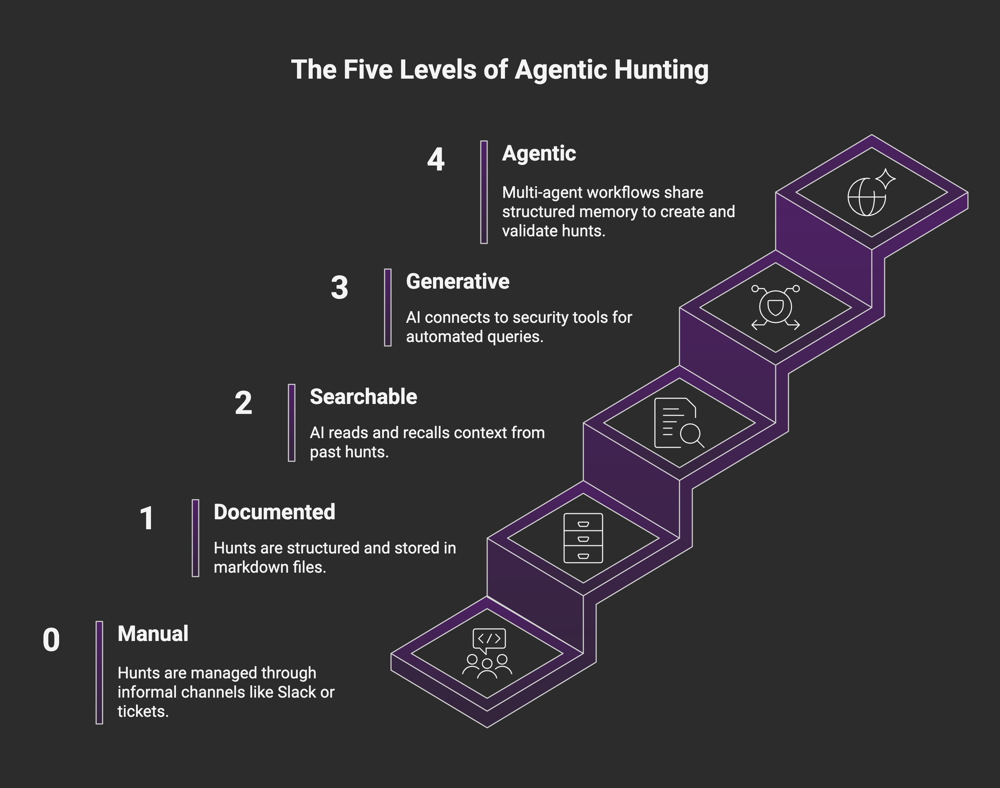
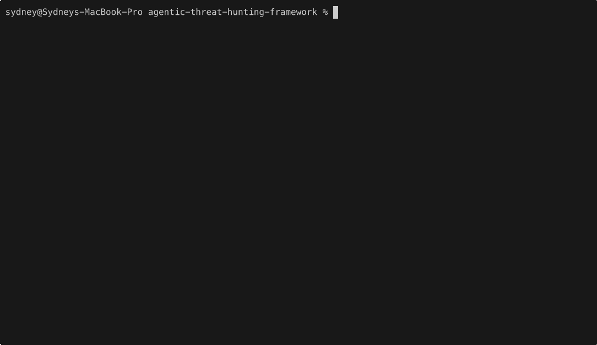

<p align="center">
  
</p>

# Agentic Threat Hunting Framework (ATHF)

[](https://www.python.org/downloads/)
[](LICENSE)
[](https://pypi.org/)
[](https://github.com/Nebulock-Inc/agentic-threat-hunting-framework/stargazers)

**[Quick Start](#quick-start)** • **[Installation](#installation)** • **[Documentation](#documentation)** • **[Examples](SHOWCASE.md)**

> Give your threat hunting program memory and agency.

The **Agentic Threat Hunting Framework (ATHF)** is the memory and automation layer for your threat hunting program. It gives your hunts structure, persistence, and context - making every past investigation accessible to both humans and AI.

ATHF works with any hunting methodology (PEAK, TaHiTI, or your own process). It's not a replacement; it's the layer that makes your existing process AI-ready.

## 🎯 What is ATHF?

**In 5 minutes, you'll have:**
- ✅ Your first documented hunt using the LOCK pattern
- ✅ A searchable knowledge base your AI assistant can query
- ✅ Templates for every hunt scenario

**In 1 week, you'll unlock:**
- 🤖 AI-powered hypothesis generation from past hunts
- 📊 Automatic hunt metrics and coverage gap analysis
- 🔍 Instant recall of 100+ past investigations

## 💡 Real Results

| Metric | Before ATHF | After ATHF (90 days) |
|--------|-------------|----------------------|
| Hypothesis generation | 20 min | 2 min (-90%) |
| Hunts documented | 5/month | 15/month (+200%) |
| Duplicate hunts | ~3/month | 0 (-100%) |
| Time to find past hunt | 15 min+ | <30 sec |

## Why It Exists

Most threat hunting programs lose valuable context once a hunt ends. Notes live in Slack or tickets, queries are written once and forgotten, and lessons learned exist only in analysts' heads.

Even AI tools start from zero every time without access to your environment, your data, or your past hunts.

ATHF changes that by giving your hunts structure, persistence, and context.

**Read more:** [docs/why-athf.md](docs/why-athf.md)

## The LOCK Pattern

Every threat hunt follows the same basic loop: **Learn → Observe → Check → Keep**.



- **Learn:** Gather context from threat intel, alerts, or anomalies
- **Observe:** Form a hypothesis about adversary behavior
- **Check:** Test hypotheses with targeted queries
- **Keep:** Record findings and lessons learned

**Why LOCK?** It's small enough to use and strict enough for agents to interpret. By capturing every hunt in this format, ATHF makes it possible for AI assistants to recall prior work and suggest refined queries based on past results.

**Read more:** [docs/lock-pattern.md](docs/lock-pattern.md)

## The Five Levels of Agentic Hunting

ATHF defines a simple maturity model. Each level builds on the previous one.

**Most teams will live at Levels 1–2. Everything beyond that is optional maturity.**



| Level | Capability | What You Get |
|-------|-----------|--------------|
| **0** | Ad-hoc | Hunts exist in Slack, tickets, or analyst notes |
| **1** | Documented | Persistent hunt records using LOCK |
| **2** | Searchable | AI reads and recalls your hunts |
| **3** | Generative | AI executes queries via MCP tools |
| **4** | Agentic | Autonomous agents monitor and act |

**Level 1:** Operational within a day
**Level 2:** Operational within a week
**Level 3:** 2-4 weeks (optional)
**Level 4:** 1-3 months (optional)

**Read more:** [docs/maturity-model.md](docs/maturity-model.md)

## 🚀 Quick Start

### Option 1: Python CLI (Recommended)

```bash
# Coming soon - pip installable package
pip install athf-framework

# Initialize your hunt program
athf init

# Create your first hunt
athf hunt new --technique T1003.001 --title "LSASS Credential Dumping"
```

### Option 2: Pure Markdown (No Installation)

```bash
# Clone the repository
git clone https://github.com/Nebulock-Inc/agentic-threat-hunting-framework
cd agentic-threat-hunting-framework

# Copy a template and start documenting
cp templates/HUNT_LOCK.md hunts/H-0001.md

# Customize AGENTS.md with your environment
# Add your SIEM, EDR, and data sources
```

**Choose your AI assistant:** Claude Code, GitHub Copilot, or Cursor - any tool that can read your repository files.

**Full guide:** [docs/getting-started.md](docs/getting-started.md)

## 🔧 CLI Commands

ATHF includes a full-featured CLI for managing your hunts. Here's a quick reference:

### Initialize Workspace

```bash
athf init                           # Interactive setup
athf init --non-interactive         # Use defaults
athf init --siem sentinel --edr defender
```

### Create Hunts

```bash
athf hunt new                       # Interactive mode
athf hunt new \
  --technique T1003.001 \
  --title "LSASS Dumping Detection" \
  --platform windows
```

### List & Search

```bash
athf hunt list                      # Show all hunts
athf hunt list --status completed   # Filter by status
athf hunt list --output json        # JSON output
athf hunt search "kerberoasting"    # Full-text search
```

### Validate & Stats

```bash
athf hunt validate                  # Validate all hunts
athf hunt validate H-0001           # Validate specific hunt
athf hunt stats                     # Show statistics
athf hunt coverage                  # MITRE ATT&CK coverage
```

**Full documentation:** [CLI Reference](docs/CLI_REFERENCE.md)

## 📺 See It In Action



Watch ATHF in action: initialize a workspace, create hunts, and explore your threat hunting catalog in under 60 seconds.

**[View example hunts →](SHOWCASE.md)**

## Installation

### Prerequisites
- Python 3.8+ (for CLI option)
- Git
- Your favorite AI code assistant

### CLI Installation (Coming Soon)

```bash
pip install athf-framework
```

### Manual Setup

```bash
git clone https://github.com/Nebulock-Inc/agentic-threat-hunting-framework
cd agentic-threat-hunting-framework
```

That's it! Start documenting hunts in the `hunts/` directory using the LOCK pattern.

## Documentation

### Core Concepts

- [Why ATHF Exists](docs/why-athf.md) - The problem and solution
- [The LOCK Pattern](docs/lock-pattern.md) - Structure for all hunts
- [Maturity Model](docs/maturity-model.md) - The five levels explained
- [Getting Started](docs/getting-started.md) - Step-by-step onboarding

### Level-Specific Guides

- [Level 1: Documented Hunts](docs/maturity-model.md#level-1-documented-hunts)
- [Level 2: Searchable Memory](docs/maturity-model.md#level-2-searchable-memory)
- [Level 3: Generative Capabilities](docs/level3-mcp-examples.md)
- [Level 4: Agentic Workflows](docs/level4-agentic-workflows.md)

### Integration & Customization

- [MCP Catalog](integrations/MCP_CATALOG.md) - Available tool integrations
- [Quickstart Guides](integrations/quickstart/) - Setup for specific tools
- [Using ATHF](USING_ATHF.md) - Adoption and customization

## 🎖️ Featured Hunts

### H-0001: macOS Information Stealer Detection

Detected Atomic Stealer collecting Safari cookies via AppleScript.
**Result:** 1 true positive, host isolated before exfiltration.

**Key Insight:** Behavior-based detection outperformed signature-based approaches. Process signature validation identified unsigned malware attempting data collection.

[View full hunt →](hunts/H-0001.md) | [See more examples →](SHOWCASE.md)

## Why This Matters

Agentic threat hunting is not about replacing analysts. It's about building systems that can:

- Remember what has been done before
- Learn from past successes and mistakes
- Support human judgment with contextual recall

When your framework has memory, you stop losing knowledge to turnover or forgotten notes. When your AI assistant can reference that memory, it becomes a force multiplier.

## 💬 Community & Support

- **GitHub Discussions:** [Ask questions, share hunts](https://github.com/Nebulock-Inc/agentic-threat-hunting-framework/discussions)
- **Issues:** [Report bugs or request features](https://github.com/Nebulock-Inc/agentic-threat-hunting-framework/issues)
- **Adoption Guide:** See [USING_ATHF.md](USING_ATHF.md) for how to use ATHF in your organization
- **Twitter/X:** [@NeblockInc](https://twitter.com/NeblockInc) - Follow for updates

## 📖 Using ATHF

ATHF is a framework to internalize, not a platform to extend. Fork it, customize it, make it yours.

**Repository:** [https://github.com/Nebulock-Inc/agentic-threat-hunting-framework](https://github.com/Nebulock-Inc/agentic-threat-hunting-framework)

See [USING_ATHF.md](USING_ATHF.md) for adoption guidance. Your hunts stay yours—sharing back is optional but appreciated ([Discussions](https://github.com/Nebulock-Inc/agentic-threat-hunting-framework/discussions)).

The goal is to help every threat hunting team move from ad-hoc memory to structured, agentic capability.

---

**Start small. Document one hunt. Add structure. Build memory.**

Memory is the multiplier. Agency is the force.
Once your program can remember, everything else becomes possible.

Happy hunting!
