<p align="center">
  
</p>

# Agentic Threat Hunting Framework (ATHF)

> Give your threat hunting program memory and agency.

The **Agentic Threat Hunting Framework (ATHF)** is the memory and automation layer for your threat hunting program. It gives your hunts structure, persistence, and context - making every past investigation accessible to both humans and AI.

ATHF works with any hunting methodology (PEAK, TaHiTI, or your own process). It's not a replacement; it's the layer that makes your existing process AI-ready.

## Why It Exists

Most threat hunting programs lose valuable context once a hunt ends. Notes live in Slack or tickets, queries are written once and forgotten, and lessons learned exist only in analysts' heads. When someone asks, "Have we hunted this before?", the answer depends entirely on who remembers.

Even AI tools start from zero every time without access to your environment, your data, or your past hunts.

ATHF changes that by giving your hunts structure, persistence, and context - turning disjointed documentation into a foundation for memory and learning.

## The Core: The LOCK Pattern

Every threat hunt follows the same basic loop: **Learn → Observe → Check → Keep**.

**Why LOCK?** It's small enough to use and strict enough for agents to interpret.

ATHF formalizes that loop with the **LOCK Pattern**, a lightweight structure that is readable by both humans and AI tools.

**Learn:** Gather context from threat intelligence, alerts, or anomalies.
*Example:* "We received CTI indicating increased use of Rundll32 for execution (T1218.011)."

**Observe:** Form a hypothesis about what the adversary might be doing.
*Example:* "Adversaries may be using Rundll32 to load unsigned DLLs to bypass security controls."

**Check:** Test the hypothesis using bounded queries or scripts.
*Example (Splunk):*

```spl
index=winlogs EventCode=4688 CommandLine="*rundll32*" NOT Signed="TRUE"
```

**Keep:** Record findings and lessons learned.
*Example:* "No evidence of execution found in the past 14 days. Query should be expanded to include encoded commands next run."

By capturing every hunt in this format, ATHF makes it possible for AI assistants to recall prior work, generate new hypotheses, and suggest refined queries based on past results.

**Without LOCK:** Every hunt is a fresh tab explosion.
**With LOCK:** Every hunt becomes part of the memory layer.

```mermaid
graph LR
    L["🔒 LEARN<br/>Gather context<br/>CTI, alert, anomaly"]
    O["👁️ OBSERVE<br/>Form hypothesis<br/>Adversary behavior"]
    C["✓ CHECK<br/>Test with query<br/>Bounded validation"]
    K["📝 KEEP<br/>Record lessons<br/>Decisions + outcomes"]

    L --> O
    O --> C
    C --> K
    K -.Memory loop.-> L

    style L fill:#e3f2fd,stroke:#1976d2,stroke-width:2px,color:#000
    style O fill:#fff3e0,stroke:#f57c00,stroke-width:2px,color:#000
    style C fill:#f3e5f5,stroke:#7b1fa2,stroke-width:2px,color:#000
    style K fill:#e8f5e9,stroke:#388e3c,stroke-width:2px,color:#000
```



## The Five Levels of Agentic Hunting

ATHF defines a simple maturity model for evolving your hunting program. Each level builds on the previous one.

**Most teams will live at Levels 1–2. Everything beyond that is optional maturity.**

| Level | Focus | What Changes | Example |
|-------|-------|--------------|---------|
| **0** | Manual | Hunts live in Slack or tickets | "Didn't we already look at this last year?" |
| **1** | Documented | Hunts are written in LOCK-structured markdown files | Markdown repo with `hunts/H-0001.md` |
| **2** | Searchable | AI reads and recalls context via context file | Claude Code summarizes past hunts in seconds |
| **3** | Generative | AI connects to your security tools via MCPs | Connect Splunk, CrowdStrike, and Jira MCPs for automated queries and enrichment |
| **4** | Autonomous | Multi-agent workflows share structured memory | Multiple agents create, validate, and document hunts |

Most teams stop at Levels 1 or 2. That alone gives enormous benefit. At Level 1, your knowledge is documented and persists beyond individuals. At Level 2, your AI assistant can search your hunt history and act as an informed partner rather than a guessing machine.

```mermaid
graph LR
    L0["Level 0<br/>Manual<br/>📝 Slack/Tickets"]
    L1["Level 1<br/>Documented<br/>📄 LOCK Markdown"]
    L2["Level 2<br/>Searchable<br/>🔍 AI Memory"]
    L3["Level 3<br/>Generative<br/>🔧 MCP Tools"]
    L4["Level 4<br/>Autonomous<br/>🤖 Multi-Agent"]

    L0 --> L1
    L1 --> L2
    L2 --> L3
    L3 --> L4

    style L0 fill:#ffebee,stroke:#c62828,stroke-width:2px,color:#000
    style L1 fill:#fff3e0,stroke:#ef6c00,stroke-width:2px,color:#000
    style L2 fill:#e8f5e9,stroke:#2e7d32,stroke-width:2px,color:#000
    style L3 fill:#e3f2fd,stroke:#1565c0,stroke-width:2px,color:#000
    style L4 fill:#f3e5f5,stroke:#6a1b9a,stroke-width:2px,color:#000
```



### Level 1: Documented Hunts

**What you get:**

- **Persistent hunt records** that survive beyond Slack threads
- **Standardized structure** using the LOCK pattern
- **Knowledge transfer** for new team members
- **Searchable history** of what's been tested

You document hunts using LOCK in markdown.

**Example:** `hunts/H-0031.md`

```markdown
# H-0031: Detecting Remote Management Abuse via PowerShell and WMI (TA0002 / T1028 / T1047)

**Learn**
Incident response from a recent ransomware case showed adversaries using PowerShell remoting and WMI to move laterally between Windows hosts.
These techniques often bypass EDR detections that look only for credential theft or file-based artifacts.
Telemetry sources available: Sysmon (Event IDs 1, 3, 10), Windows Security Logs (Event ID 4624), and EDR process trees.

**Observe**
Adversaries may execute PowerShell commands remotely or invoke WMI for lateral movement using existing admin credentials.
Suspicious behavior includes PowerShell or wmiprvse.exe processes initiated by non-admin accounts or targeting multiple remote systems in a short time window.

**Check**
index=sysmon OR index=edr
(EventCode=1 OR EventCode=10)
| search (Image="*powershell.exe" OR Image="*wmiprvse.exe")
| stats count dc(DestinationHostname) as unique_targets by User, Computer, CommandLine
| where unique_targets > 3
| sort - unique_targets

**Keep**
Detected two accounts showing lateral movement patterns:
- `svc_backup` executed PowerShell sessions on five hosts in under ten minutes
- `itadmin-temp` invoked wmiprvse.exe from a workstation instead of a jump server

Confirmed `svc_backup` activity as legitimate backup automation.
Marked `itadmin-temp` as suspicious; account disabled pending review.

Next iteration: expand to include remote registry and PSExec telemetry for broader coverage.
```

When someone new joins the team, they can quickly see what was tested, what was learned, and what should be tried next. This alone prevents redundant hunts and lost context.

### Level 2: Searchable Memory

**What you get:**

- **AI reads your repo** and understands your hunt history
- **AI recalls past hunts** when you ask questions
- **AI gives contextually correct suggestions** based on your environment
- **Instant context retrieval** - seconds instead of minutes

At Level 2, you add context files to your repository that provide AI assistants (Claude Code, GitHub Copilot, Cursor) with the knowledge they need to assist effectively:

**[AGENTS.md](AGENTS.md)** - Provides environmental and structural context:

- Your repository structure (hunts/, templates/, queries/)
- Available data sources (SIEM indexes, EDR platforms, network logs)
- Workflow expectations and guardrails
- How AI should search past hunts before generating new ones

**[.claude/hunting-knowledge.md](.claude/hunting-knowledge.md)** - Embeds threat hunting expertise:

- Pattern-based hypothesis generation frameworks (TTP-driven, Actor-driven, Behavior-driven, Telemetry Gap-driven)
- Quality criteria for evaluating hypotheses (falsifiable, scoped, observable, actionable, contextual)
- Observable-to-TTP mapping guidance
- Data quality considerations (completeness, timeliness, fidelity, accuracy, consistency)
- Best practices for working within the LOCK pattern

**What it enables:** Once these context files exist, you can open your repo in Claude Code or similar tools and ask:

> "What have we learned about T1028?"

The AI automatically searches your hunts directory, references past investigations, and suggests refined hypotheses based on lessons learned - applying expert threat hunting frameworks from the knowledge base. What used to take 20 minutes of grepping and copy-pasting now takes under five seconds.

**The combination of AGENTS.md (environmental context) and hunting-knowledge.md (domain expertise) transforms AI assistants from generic helpers into informed threat hunting partners.**

**See the full [AGENTS.md](AGENTS.md) file** for repository structure and workflow guidance, and [.claude/hunting-knowledge.md](.claude/hunting-knowledge.md) for the complete threat hunting knowledge base.

```mermaid
graph TB
    T1["⏱️ 15-20 minutes"]
    T2["⏱️ 3-5 minutes"]

    subgraph Level1["📋 Level 1: Manual"]
        direction LR
        M1["💭 Think"] --> M2["🔍 Grep"] --> M3["📋 Copy-paste"] --> M4["💻 Draft"] --> M5["✅ Validate"]
    end

    T1 -.-> Level1
    Level1 -.Upgrade to Level 2.-> Level2

    subgraph Level2["🤖 Level 2: AI-Assisted"]
        direction LR
        A1["💬 Ask Claude"] --> A2["🤖 AI searches"] --> A3["📝 Generated"]
    end

    T2 -.-> Level2

    style Level1 fill:#ffebee,stroke:#c62828,stroke-width:3px,color:#000
    style Level2 fill:#e8f5e9,stroke:#2e7d32,stroke-width:3px,color:#000
    style T1 fill:#fff,stroke:#999,stroke-dasharray: 5 5,color:#000
    style T2 fill:#fff,stroke:#999,stroke-dasharray: 5 5,color:#000
    style M1 fill:#fff,stroke:#999,color:#000
    style M2 fill:#fff,stroke:#999,color:#000
    style M3 fill:#fff,stroke:#999,color:#000
    style M4 fill:#fff,stroke:#999,color:#000
    style M5 fill:#fff,stroke:#999,color:#000
    style A1 fill:#fff,stroke:#999,color:#000
    style A2 fill:#fff,stroke:#999,color:#000
    style A3 fill:#fff,stroke:#999,color:#000
```



### Level 3: Generative Capabilities

**What you get:**

- **AI executes queries** directly in your SIEM
- **AI enriches findings** with threat intel lookups
- **AI creates tickets** in your case management system
- **AI updates hunt files** with results and commits changes

At this stage, you give your AI assistant **tools to interact with your security stack** via MCP (Model Context Protocol) servers. Instead of manually copying queries to Splunk or looking up IOCs in threat intel, Claude does it directly.

**Level 3 is about execution. The AI doesn't just suggest queries; it runs them with your tools.**

**Introduce Optional MCP Servers or APIs for Your Tools:**

Connect MCP servers or APIs for the tools you already use in your security operations:

- **SIEM search** (Splunk, Elastic, Chronicle)
- **Endpoint data** (CrowdStrike, SentinelOne, Microsoft Defender)
- **Ticket creation** (Jira, ServiceNow, GitHub Issues)
- **Threat intel queries** (MISP, VirusTotal, AlienVault OTX)

**Your Assistant Can:**

- **Run queries** - Execute hunt queries and retrieve results directly
- **Enrich findings** - Look up IOCs, correlate threat intelligence, check reputation
- **Update hunts** - Document findings and commit changes to hunt files
- **Trigger actions** - Create tickets, generate alerts, update case management

**Level 3 is "Bring Your Own Tools"** - you connect MCP servers or APIs for whatever tools you already use: SIEM, threat intel, EDR, ticketing, asset inventory, etc.

```mermaid
graph LR
    A["💬 Suggest<br/>AI drafts query"] --> B["▶️ Execute<br/>Run in SIEM"]
    B --> C["🔍 Enrich<br/>Lookup IOCs"]
    C --> D["📝 Document<br/>Update hunt file"]

    style A fill:#e3f2fd,stroke:#1976d2,stroke-width:2px,color:#000
    style B fill:#fff3e0,stroke:#f57c00,stroke-width:2px,color:#000
    style C fill:#f3e5f5,stroke:#7b1fa2,stroke-width:2px,color:#000
    style D fill:#e8f5e9,stroke:#388e3c,stroke-width:2px,color:#000
```



**Example MCP Integrations:**

- **Splunk:** Execute hunt queries, retrieve results (official MCP available)
- **CrowdStrike:** Query endpoint telemetry (official MCP available)
- **Jira:** Auto-create incident tickets (official MCP available)
- **Your tools:** Find MCPs for your specific security stack

**Example: SIEM Query Execution**

Without MCP (Level 2):

```
You: "Search for SSH brute force attempts"
Claude: "Here's a Splunk query: index=linux_secure action=failure | stats count by src_ip"
You: [Copies query to Splunk, runs it, pastes results back]
Claude: "I see 3 high-volume IPs..."
```

With Splunk MCP (Level 3):

```
You: "Search for SSH brute force attempts"
Claude: [Executes Splunk query via MCP]
"Found 3 source IPs with high failure rates:
- 203.0.113.45 (127 attempts)
- 198.51.100.22 (89 attempts)
- 192.0.2.15 (67 attempts)

Let me check CrowdStrike for detections..."
[Queries CrowdStrike MCP]
"203.0.113.45 connected to 3 hosts with Qakbot detections.
Should I create a Jira ticket for investigation?"
```

**The difference:** Claude executes queries, enriches data, and creates tickets - not just suggests them.

**Multi-MCP Workflow Example**

Run an entire hunt end-to-end:

```
You: "Execute hunt H-0042"

Claude:
1. [Reads H-0042.md hypothesis file (example)]
2. [Splunk MCP] Executes detection query
3. [CrowdStrike MCP] Validates suspicious hosts found
4. [Jira MCP] Creates incident tickets for confirmed threats
5. Updates hunt file with findings and commits

"Hunt completed in 2 minutes:
- 9 suspicious events found
- 1 confirmed Qakbot C2 (203.0.113.45)
- 3 incident tickets created (SEC-1547, SEC-1548, SEC-1549)
- Hunt updated with execution results"
```

**Getting Started with Level 3**

1. **Browse the catalog:** See [integrations/MCP_CATALOG.md](integrations/MCP_CATALOG.md)
2. **Pick your first MCP:** Start with Splunk or CrowdStrike
3. **Follow quickstart guide:** [integrations/quickstart/](integrations/quickstart/)
4. **Review example hunts:** See [hunts/](hunts/) directory for examples

**Level 3 Success Criteria:**

- Claude **executes** hunt queries instead of just writing them
- IOCs are **enriched** automatically with threat intel
- Incident tickets are **created** with full context
- You focus on **analysis and decision-making**, not manual task execution

**Learn more:** [integrations/README.md](integrations/README.md)

### Level 4: Autonomous Workflows

**What you get:**

- **Agents monitor** CTI feeds without your intervention
- **Agents generate** draft hunts based on new threats
- **Agents coordinate** through shared LOCK memory
- **You validate and approve** rather than create from scratch

At this stage, you move from **reactive assistance** to **proactive automation**. Instead of asking your AI for help with each task, you deploy autonomous agents that monitor, reason, and act based on objectives you define.

The key difference from Level 3: **agents operate autonomously** rather than waiting for your prompts. They detect events, make decisions within guardrails, and coordinate with each other through shared memory (your LOCK-structured hunts).

**Example: Multi-Agent Hunt Pipeline**

<details>
<summary>Example Multi-Agent Workflow (Conceptual)</summary>

Below is a **conceptual example** showing how multiple autonomous agents could coordinate. This is not included in the repository - it represents a pattern you would implement using your chosen agent framework:

```yaml
# Example: config/agent_workflow.yaml
# Conceptual configuration for autonomous agents

agents:
  - name: cti_monitor
    role: Watch CTI feeds and identify relevant threats
    triggers:
      - schedule: "every 6 hours"
      - webhook: "/api/cti/new"
    actions:
      - search_hunts(technique_id)  # Check if we've hunted this before
      - trigger_agent("hypothesis_generator") if new_technique

  - name: hypothesis_generator
    role: Create LOCK-formatted hunt hypotheses
    triggers:
      - agent_event: "cti_monitor.new_technique"
    actions:
      - search_hunts(technique_id)  # Get historical context
      - generate_lock_hypothesis()
      - validate_query()
      - create_draft_hunt_file()
      - trigger_agent("validator")

  - name: validator
    role: Review and validate draft hunts
    triggers:
      - agent_event: "hypothesis_generator.draft_ready"
    actions:
      - validate_query(query, platform)
      - check_data_source_compatibility()
      - flag_for_human_review() if issues_found
      - trigger_agent("notifier")

  - name: notifier
    role: Alert analysts when hunts need review
    triggers:
      - agent_event: "validator.review_needed"
    actions:
      - post_to_slack(channel="#threat-hunting", hunt_id)
      - create_github_issue(labels=["hunt-review"])

guardrails:
  - all_hunts_require_human_approval: true
  - no_automatic_query_execution: true
  - log_all_agent_actions: true
  - daily_summary_report: true
```

</details>

**How It Works (Example Scenario):**

1. **CTI Monitor Agent** runs every 6 hours, checking threat feeds
2. Detects new Qakbot campaign using T1059.003
3. Searches past hunts - finds we haven't covered this sub-technique
4. **Triggers Hypothesis Generator Agent**
5. Generator searches historical hunts for context
6. Creates draft hunt `H-0156.md` with LOCK structure
7. **Triggers Validator Agent**
8. Validator checks query against data sources from `AGENTS.md`
9. Flags for human review
10. **Triggers Notifier Agent**
11. Posts to Slack: "New hunt H-0156 ready for review"

**You wake up to:**
> "3 new draft hunts created overnight based on recent CTI. Ready for your review."

**The difference:**

- **Level 2:** You ask AI questions, it responds
- **Level 3:** You direct AI to use tools
- **Level 4:** Agents work autonomously toward objectives, notify you when human judgment is needed

At Level 4, success looks like this:

- Agents **monitor** CTI feeds without your intervention
- Agents **generate** draft hunts based on new threats
- Agents **coordinate** through shared memory (LOCK hunts)
- You focus on **validating** and **approving** rather than creating from scratch

**Implementation Options:**

Level 4 can be built using various agent frameworks:

- **LangGraph** - For building stateful, multi-agent workflows
- **CrewAI** - For role-based agent collaboration
- **AutoGen** - For conversational agent patterns
- **Custom orchestration** - Purpose-built for your environment

The key is that **all agents share the same memory layer** - your LOCK-structured hunts - ensuring consistency and enabling true coordination.

## How to Get Started

1. **Clone the repository**

   ```bash
   git clone https://github.com/Nebulock-Inc/agentic-threat-hunting-framework
   ```

2. Review the `templates/` and `hunts/` directories

3. Start documenting new hunts using the LOCK pattern

4. Add context files once you have a few hunts recorded:
   - **AGENTS.md** - Your environment, data sources, and workflows
   - **.claude/hunting-knowledge.md** - Threat hunting expertise and frameworks (included in repo)

5. Choose an AI assistant that can read your files and start using memory-aware prompts

You can be operational at **Level 1 within a day** and **Level 2 within a week**. No coding or infrastructure changes are required until Level 3.

## Why This Matters

Agentic threat hunting is not about replacing analysts. It is about building systems that can:

- Remember what has been done before
- Learn from past successes and mistakes
- Support human judgment with contextual recall

When your framework has memory, you stop losing knowledge to turnover or forgotten notes. When your AI assistant can reference that memory, it becomes a force multiplier instead of a curiosity.

## Feedback and Contributions

ATHF is open source and under active development. Feedback, forks, and pull requests are welcome.

You can find the repository here:
**[https://github.com/Nebulock-Inc/agentic-threat-hunting-framework](https://github.com/Nebulock-Inc/agentic-threat-hunting-framework)**

Try it in your own environment, adapt it to your workflow, and share what you learn. The goal is to help every threat hunting team move from ad-hoc memory to structured, agentic capability.

If you build on ATHF, I would love to hear about your implementation and how your team integrates memory into the hunt loop.

**Happy thrunting!**

---

## Closing

ATHF is a framework for the future of threat hunting. It learns, remembers, and scales with you.

**Start small. Document one hunt. Add structure. Build memory.**

Memory is the multiplier. Agency is the force.
Once your program can remember, everything else becomes possible.

Happy thrunting!
