<div align="center">
  
</div>

# Agentic Threat Hunting Framework (ATHF)

**Give your threat hunting program memory and agency.**

ATHF is a framework for building threat hunting systems that remember past investigations, learn from outcomes, and augment human decision-making. It provides structure for progressing from manual hunting to AI-coordinated operations.

**Use it standalone, or layer it over [PEAK](https://www.splunk.com/en_us/blog/security/peak-threat-hunting-framework.html), [SQRRL](https://www.threathunting.net/files/The%20Threat%20Hunting%20Reference%20Model%20Part%202_%20The%20Hunting%20Loop%20_%20Sqrrl.pdf), or your existing methodology.**

## Why ATHF?

**The Problem:**
Attackers are using AI to get faster and better. Defenders need AI too. But how do we actually do that?

Existing threat hunting frameworks ([PEAK](https://www.splunk.com/en_us/blog/security/peak-threat-hunting-framework.html), [SQRRL](https://www.threathunting.net/files/The%20Threat%20Hunting%20Reference%20Model%20Part%202_%20The%20Hunting%20Loop%20_%20Sqrrl.pdf), [TaHiTI](https://www.betaalvereniging.nl/en/safety/tahiti/)) teach you *how to hunt*, but not *how to integrate AI into your hunting program*.

Without structure for memory and AI integration:
- Hunt notes scattered across Slack, tickets, or living in hunters' heads
- "Foggy memory" - you remember hunting something similar, but not the details
- AI assistance is ad-hoc (copy/paste to ChatGPT with no context)
- Knowledge evaporates when hunters leave
- No foundation for AI to build on

**ATHF's Solution:**
A framework specifically for building **agentic capability** in threat hunting:

1. **LOCK Pattern** - AI-ready structure for hunt documentation
2. **Memory by Design** - Architecture for recall (grep → AI-integrated → structured)
3. **Maturity Progression** - Pragmatic path from manual to AI-augmented
4. **Integration Patterns** - Works with PEAK, SQRRL, or your existing methodology

**What Makes ATHF Different:**

| Framework | Focus | What It Teaches | Complements ATHF? |
|-----------|-------|-----------------|-------------------|
| **PEAK** | Hunting process | "How should teams hunt systematically?" | ✅ Yes - ATHF adds AI integration |
| **SQRRL** | Hypothesis-driven operations | "How do we validate threat hypotheses?" | ✅ Yes - ATHF structures for AI |
| **TaHiTI** | Team coordination | "How do hunt teams work together?" | ✅ Yes - ATHF adds memory + AI |
| **ATHF** | AI integration | "How do we integrate AI into hunting?" | Standalone or layered |

**In short:**
- **PEAK/SQRRL/TaHiTI**: *Process frameworks* (how humans hunt)
- **ATHF**: *AI integration framework* (how to structure hunts for AI)

## Prerequisites: Get the Basics Down First

**ATHF is not a threat hunting 101 course.** You need to be actively hunting before this framework provides value.

Before implementing ATHF, you should have:
- **Access to security data** - SIEM, EDR, logs, or other telemetry sources
- **Basic hunting skills** - Ability to form hypotheses and recognize adversary behavior
- **Query capabilities** - Can write SPL, KQL, SQL, or use your platform's query language
- **Active hunting practice** - Actually conducting hunts (even if ad-hoc or poorly documented)

**If you're not hunting yet**, start with:
- [PEAK Framework](https://www.splunk.com/en_us/blog/security/peak-threat-hunting-framework.html) for hunting process
- [MITRE ATT&CK](https://attack.mitre.org/) for adversary TTPs
- [Threat Hunting Project](https://www.threathunting.net/) for hunting fundamentals

**ATHF assumes you're already hunting.** It helps you structure your existing hunting work for AI integration - it doesn't teach you *how* to hunt.

## What ATHF Is

ATHF is both a **conceptual framework** and a **practical toolkit** for agentic threat hunting - building systems that can remember, learn, and augment human decision-making.

**Core Components:**

1. **LOCK Pattern** - AI-ready structure for documenting hunts
2. **Memory Architecture** - From simple grep to AI-integrated to structured systems
3. **5 Levels of Agentic Hunting** - Maturity model from manual to AI-augmented operations
4. **Templates & Patterns** - Practical implementations you can copy

**Relationship:**
- **Standalone**: Use ATHF's LOCK pattern and maturity model to build agentic capability from scratch
- **Layered**: Apply ATHF's memory and AI patterns to your existing PEAK/SQRRL workflow

## Why LOCK?

LOCK (Learn → Observe → Check → Keep) is the AI-ready structure for threat hunting:

- **Learn**: Gather context (CTI, alert, anomaly)
- **Observe**: Form hypothesis about adversary behavior
- **Check**: Test with bounded query
- **Keep**: Record decision and lessons learned

## The LOCK Pattern

Every threat hunting methodology follows the same core pattern—ATHF calls it **LOCK**:

```
🔒 Learn → Observe → Check → Keep
```

**L — Learn**: Gather context (CTI, alert, anomaly)
**O — Observe**: Form hypothesis about adversary behavior
**C — Check**: Test with bounded query
**K — Keep**: Record decision and lessons learned

```mermaid
graph LR
    L["🔒 LEARN<br/>Gather context<br/>CTI, alert, anomaly"]
    O["👁️ OBSERVE<br/>Form hypothesis<br/>Adversary behavior"]
    C["✓ CHECK<br/>Test with query<br/>Bounded validation"]
    K["📝 KEEP<br/>Record lessons<br/>Decisions + outcomes"]

    L --> O
    O --> C
    C --> K
    K -.Memory loop.-> L

    style L fill:#e3f2fd,stroke:#1976d2,stroke-width:2px
    style O fill:#fff3e0,stroke:#f57c00,stroke-width:2px
    style C fill:#f3e5f5,stroke:#7b1fa2,stroke-width:2px
    style K fill:#e8f5e9,stroke:#388e3c,stroke-width:2px
```



LOCK isn't a new methodology—it's the **structure that makes your hunts AI-readable**.

- **At Level 1: Persistent**: LOCK provides team consistency
- **At Level 2: Augmented**: LOCK enables AI to parse your hunt history
- **At Level 3+**: LOCK enables automation and multi-agent workflows

By standardizing hunt notes around LOCK, AI can understand your hunts regardless of which framework (PEAK, SQRRL, TaHiTI) you use.

## The 5 Levels of Agentic Hunting

| Level | Name | What Changes | Memory | AI Integration | Tools |
|-------|------|--------------|--------|----------------|-------|
| **0. Ephemeral** | Knowledge Disappears | Hunts in Slack, tickets, heads | None | Optional (copy/paste) | Slack, tickets, docs |
| **1. Persistent** | Knowledge Captured | LOCK-structured markdown in repo | Searchable files (grep) | Optional (copy/paste) | Git, markdown, grep |
| **2. Augmented** | AI Partner with Memory | AI reads repo context via AGENTS.md | Files + AGENTS.md | AI agent integrated | GitHub Copilot, Claude Code |
| **3. Autonomous** | Automated Tasks | Scripts for repetitive workflows | Files + optional structure | Scripted agents | Python + AI APIs |
| **4. Coordinated** | Multi-Agent Systems | Multiple specialized agents | Structured (JSON/DB) | Multi-agent orchestration | LangChain, AutoGen |

**Start at Level 0. Most teams operate at Level 1-2. Progress only when complexity demands it.**

```mermaid
graph LR
    L0["Level 0<br/>Ephemeral"]
    L1["Level 1<br/>Persistent"]
    L2["Level 2<br/>Augmented"]
    L3["Level 3<br/>Autonomous"]
    L4["Level 4<br/>Coordinated"]

    L0 --> L1
    L1 --> L2
    L2 --> L3
    L3 --> L4

    style L0 fill:#f5f5f5,stroke:#9e9e9e
    style L1 fill:#fff9c4,stroke:#fbc02d,stroke-width:3px
    style L2 fill:#fff9c4,stroke:#fbc02d,stroke-width:3px
    style L3 fill:#e1f5fe,stroke:#0288d1
    style L4 fill:#f3e5f5,stroke:#9c27b0

    Sweet["⭐ Most teams operate here"]
    Sweet -.-> L1
    Sweet -.-> L2

    style Sweet fill:#ffffcc,stroke:#ff9800,stroke-width:2px,stroke-dasharray: 5 5
```



## Philosophy

ATHF is a **framework for building agentic capability**, not a replacement for hunting methodologies.

**ATHF's thesis:**
Threat hunting becomes more effective when systems can:
1. **Remember** - Recall past hunts to avoid duplication and apply lessons
2. **Learn** - Identify patterns in what works and what doesn't
3. **Decide** - Augment human decision-making with AI assistance on validated patterns

**How ATHF achieves this:**
- **LOCK Pattern** - Standardizes hunt documentation for AI parsing
- **Memory Design** - Scalable architecture from grep to weighted systems
- **Maturity Levels** - Pragmatic progression path (don't over-engineer early)
- **Agent Patterns** - Practical examples for single-agent → multi-agent → learning systems

**Use ATHF when:**
- You want AI to assist or augment hunting tasks
- You need memory across hunts (avoid duplicates, apply lessons)
- You're building toward agent-driven hunting operations
- You want to make your hunting program learnable by machines

## Three Rules for Agentic Hunting

1. **Validate AI output** - Never run AI-generated queries without review
2. **Build memory first** - Agents without memory repeat mistakes
3. **Progress gradually** - Level 1: Persistent is better than Level 0: Ephemeral, even if you never reach Level 4: Coordinated

## What You Get

### Templates (`templates/`)
AI-ready templates for hunt hypotheses, execution reports, and queries. Designed to be:
- **Parseable by AI** - Structured markdown AI can read and write
- **Framework-agnostic** - Works with PEAK, SQRRL, or custom processes
- **Memory-first** - Captures lessons for future recall

### AI Prompts (`prompts/`)
- **hypothesis-generator.md** - Generate testable hypotheses from context
- **query-builder.md** - Draft safe, bounded queries
- **summarizer.md** - Document results and lessons learned

Copy these prompts into ChatGPT, Claude, or your AI tool.

### Example Hunt (`hunts/H-0001`)
Real-world example showing:
- How to structure hunt notes for AI parsing
- How to build memory through dated executions
- How lessons learned improve future hunts

### Memory System Guide (`memory/`)
- Level 1-2: Persistent/Augmented - Grep-based memory (no additional tools)
- Level 3+: Autonomous/Coordinated - When to add structured memory (JSON, SQLite)
- Scaling guidance for 10, 50, 500+ hunts

### Environmental Context (`environment.md`)
Context file that informs hunt planning and AI-assisted hypothesis generation:

**environment.md** - Tech stack inventory:
- Security tools (SIEM, EDR, network monitoring)
- Technology stack (languages, frameworks, databases, cloud platforms)
- Internal documentation links (wikis, architecture diagrams, asset inventory)
- Network architecture and infrastructure
- Patch status and CVE context (for awareness, not hunting driver)

**How this supports hunting:**
- **Level 0-1**: Manual reference when planning hunts
- **Level 2**: AI reads environment.md to suggest relevant data sources and validate hypothesis feasibility
- **Level 3+**: Agents auto-validate hunts against tech stack, identify telemetry gaps

**Example Level 2 workflow:**
```
You: "Generate hypothesis for credential dumping via LSASS"
AI: *reads environment.md*
    "I see you have Windows systems with Sysmon Event ID 10 (process access).
    I'll focus the hypothesis on detecting MiniDump API calls to lsass.exe..."
```

See environment.md template for detailed inventory structure.

## Progression Guide

### Level 0 → 1: Build the Repo (Week 1)

**What to do:**
1. Create a repository (GitHub, SharePoint, Confluence, Jira, or local folder)
2. Copy ATHF templates for LOCK-structured hunts
3. Start documenting new hunts in markdown
4. Commit/save each completed hunt

**Win:** Memory persists. Knowledge doesn't disappear when people leave.

**Cost:** Free

**Skills:** None (just markdown)

**Signal you're ready for Level 2: Augmented:** You have 5-10 hunt files and find yourself manually searching before each new hunt.

---

### Level 1 → 2: Add AI Integration (Week 2-4)

**What to do:**
1. Create minimal AGENTS.md file in your repo root:
   ```markdown
   # AGENTS.md - Context for AI Assistants

   ## Purpose
   This repo contains threat hunting hypotheses and outcomes using LOCK pattern.
   AI assistants use this to suggest new hunts and recall lessons learned.

   ## Data Sources
   - winlogs (Windows Event Logs)
   - edr (CrowdStrike Falcon telemetry)
   - proxy (Zscaler web proxy logs)

   ## Guardrails
   - AI drafts, humans review
   - Never execute queries without validation
   ```

2. Choose your AI tool (use what your organization approves):
   - **GitHub Copilot** - [Setup docs](https://docs.github.com/en/copilot)
   - **Claude Code** - [Setup docs](https://docs.anthropic.com/claude/docs/claude-code)
   - **Cursor** - [Setup docs](https://cursor.sh/docs)
   - **Others**: Any AI tool that can read files

3. Start asking questions about your hunt history:
   ```
   You: "What have we learned about brute force attacks?"
   AI: *searches repo* "Based on H-0005 and H-0012..."

   You: "Generate hypothesis for VPN brute force"
   AI: *reads past hunts* "Adversaries may attempt..."
   ```

**The Difference This Makes:**

#### Level 1: Persistent - Manual (15-20 min)

```mermaid
graph LR
    L1_Start[CTI Report] --> L1_Grep[Manual grep:<br/>T1003 LSASS]
    L1_Grep --> L1_Read[Read 3 files<br/>manually]
    L1_Read --> L1_Copy[Copy/paste to<br/>ChatGPT]
    L1_Copy --> L1_Draft[Get hypothesis]
    L1_Draft --> L1_File[Manually create<br/>hunt file]
    L1_File --> L1_Query[Write query]
    L1_Query --> L1_Time[⏱️ 15-20 min]

    style L1_Time fill:#ffcccc,stroke:#ff0000
```



#### Level 2: Augmented - AI Partner (3-5 min)

```mermaid
graph LR
    L2_Start[CTI Report] --> L2_Ask[Ask AI:<br/>What about LSASS?]
    L2_Ask --> L2_Auto[AI auto-searches<br/>& summarizes]
    L2_Auto --> L2_Gen[Ask: Generate<br/>hypothesis]
    L2_Gen --> L2_Create[Ask: Create<br/>hunt file]
    L2_Create --> L2_Query[Ask: Generate<br/>query]
    L2_Query --> L2_Time[⏱️ 3-5 min]

    style L2_Time fill:#ccffcc,stroke:#00ff00
```



**Win:** Stop manually grepping. AI becomes your memory interface.

**Cost:** ~$10-20/month

**Skills:** None (no coding)

**Signal you're ready for Level 3: Autonomous:** A specific task feels tedious after doing it 10+ times.

---

### AI-Assisted Hunting Quick Start (Level 2)

Once you have AGENTS.md configured and an AI tool installed, here's your typical workflow:

#### Generating Hypotheses from Threat Intel

**Scenario:** You receive threat intelligence about adversary TTPs or emerging attack patterns

**Workflow:**

1. **Open your AI tool** (Claude Code, GitHub Copilot, Cursor) in your hunt repository

2. **Ask the AI to check memory first:**
   ```
   You: "Check if we've hunted for T1218.011 (Rundll32 execution) before"

   AI: *searches hunts/ folder*
        "Found H-0018 from 3 months ago targeting Rundll32 DLL execution.
        That hunt focused on unsigned DLLs. Should I generate a new hypothesis
        for a different angle, like suspicious command-line patterns?"
   ```

3. **Request hypothesis generation:**
   ```
   You: "Yes, generate a LOCK-structured hypothesis for Rundll32 abuse"

   AI: *reads AGENTS.md, environment.md, past Rundll32 hunts*
        *generates complete hypothesis with:*
        - Testable hypothesis statement
        - Context (why now, ATT&CK mapping T1218.011)
        - Data sources from YOUR environment
        - Time range recommendations
        - Query approach with lessons from H-0018
   ```

4. **Review and create hunt file:**
   ```
   You: "Create this as H-0025.md in the hunts/ folder"

   AI: *creates file with generated hypothesis*
   ```

5. **Generate query:**
   ```
   You: "Draft a Splunk query for this hypothesis with safety bounds"

   AI: *references past queries, adds time limits, result caps*
        *creates query in queries/H-0025.spl*
   ```

**Total time: 3-5 minutes instead of 15-20 minutes manual work**

#### Key AI Commands to Use

**Memory Recall:**
- "What have we learned about [TTP/behavior]?"
- "Find past hunts for T1110 brute force"
- "Have we hunted this before?"

**Hypothesis Generation:**
- "Generate hypothesis for [TTP/threat intel]"
- "Based on past [similar hunt], create a new hypothesis for [new context]"

**Query Building:**
- "Draft a query for this hypothesis with safety bounds"
- "What false positives did we find in similar past hunts?"
- "Generate query using data sources from environment.md"

**Documentation:**
- "Summarize these hunt results in LOCK format"
- "Document lessons learned from this hunt"
- "Create execution report with findings and next actions"

#### What Makes This Work

The AI can assist effectively because:

1. **AGENTS.md** tells it how to use your repository
2. **LOCK structure** provides consistent format for parsing
3. **Past hunts** serve as memory for lessons learned
4. **environment.md** ensures suggestions match your tech stack and data sources

#### Common Pitfalls to Avoid

**Don't:** Just copy/paste AI output without review
**Do:** Validate queries before running, check false positive rate

**Don't:** Let AI generate queries for data sources you don't have
**Do:** Keep environment.md updated so AI knows your capabilities

**Don't:** Skip checking past hunts (duplicates waste time)
**Do:** Always ask AI to search memory first

**Don't:** Trust AI to remember across sessions without context
**Do:** Use AGENTS.md to provide persistent context

---

### Level 2 → 3: Automate One Task (Month 3-6)

**What to do:**
1. Identify the most repetitive task in your workflow
2. Write a simple Python script that:
   - Searches past hunts
   - Calls AI API (OpenAI, Anthropic, or Azure OpenAI)
   - Produces output (hypothesis, documentation, or file creation)
3. Test thoroughly before trusting it

**Examples:**
- Auto-generate hunt ideas from CTI feeds
- Script that formats investigation notes into LOCK structure
- Automated "similar hunt finder"

**Use your Level 2: Augmented AI tool to help write the script.**

**Win:** Repetitive tasks happen automatically.

**Cost:** ~$10-60/month

**Skills:** Basic Python

**Signal you're ready for Level 4: Coordinated:** You have 50+ hunts, grep is slow, or you need parallel agents.

---

### Level 3 → 4: Multi-Agent Coordination (Year 1+)

**What to do:**
1. Add structured memory (SQLite database or JSON index)
2. Build specialized agents:
   - **Research agent**: Pulls threat intel + past hunts
   - **Query agent**: Generates SIEM queries
   - **Documentation agent**: Writes execution reports
3. Use orchestration framework (LangChain, AutoGen, or custom)
4. Agents share access to central memory

**Win:** Complex workflows become partially autonomous.

**Cost:** ~$50-200+/month

**Skills:** Python + orchestration frameworks

**Reality check:** Most teams stop at Level 1-2. Only pursue this if you have 100+ hunts and dedicated engineering resources.

## What You'll Need From Your Tech Stack

ATHF is designed to work with what you already have. Here's what's required at each maturity level:

### Level 0-1: Ephemeral → Persistent
**Requirements:**
- **Storage**: Any folder (git, SharePoint, Confluence, Jira, local)
- **SIEM Access**: Read-only query access to your SIEM
- **Skills**: Write/edit markdown files
- **Cost**: Free

**That's it.** No APIs, no infrastructure, no code.

### Level 2: Augmented (AI Partner)
**Additional:**
- **AI Tool**: GitHub Copilot, Claude Code, Cursor, or org-approved tool that can read files
- **Setup**: See tool docs (links in progression guide above)
- **Skills**: None (no coding)
- **Cost**: ~$10-20/month

**Still no coding required.** Just install an AI tool and point it at your repo.

### Level 3: Autonomous (Automation)
**Additional:**
- **Programming**: Basic Python
- **AI API**: OpenAI, Anthropic, or Azure OpenAI
- **Environment**: Python 3.8+
- **Infrastructure**: Runs on your laptop or single VM
- **Cost**: ~$10-60/month

### Level 4: Coordinated (Multi-Agent)
**Additional:**
- **Structured Memory**: SQLite or PostgreSQL
- **Agent Framework**: LangChain, AutoGen, or custom
- **Infrastructure**: Dedicated VM (2-4 CPU, 8GB RAM)
- **Cost**: ~$50-200+/month

**This is rare.** Most teams stop at Level 1-2.

## Integration Patterns

### Storage Options
| Storage | Best For | Grep Support | Team Collaboration |
|---------|----------|--------------|-------------------|
| **Git** | Teams, version control | ✅ Native | ✅ Pull requests |
| **Local Folders** | Solo hunters | ✅ Native | ❌ No |
| **SharePoint/Confluence** | Enterprise compliance | ⚠️ Via export | ✅ Comments |
| **Jira/ServiceNow** | Integration with tickets | ⚠️ Via export | ✅ Workflows |
| **Notion/Obsidian** | Knowledge management | ✅ Search API | ✅ Sharing |

**Recommendation:** Start with git (free, grep-friendly, team-ready). Export to other tools as needed.

### AI Tools by Level
| Level | Tool | Cost | Skills Required |
|-------|------|------|-----------------|
| **0-1** | Optional (ChatGPT copy/paste) | $0-20/mo | None |
| **2** | GitHub Copilot, Claude Code, Cursor | $10-20/mo | None |
| **3** | OpenAI/Anthropic API | $10-60/mo | Basic Python |
| **4** | LangChain, AutoGen | $50-200+/mo | Python + orchestration |

## Examples

### Level 1: Persistent - Manual Grep

```bash
# Before starting a hunt, search past work
grep -l "T1059.001" hunts/*.md
# Results: H-0015.md, H-0023.md

# Read files manually, apply lessons to new hunt
```

### Level 2: Augmented - AI with Memory

```
You → AI: "What have we learned about T1059.001 PowerShell?"

AI: *searches repo* "Based on H-0015 and H-0023:
- Most persistence via scheduled tasks
- WMI event consumers less common
- Base64 encoding standard for evasion"

You → AI: "Generate hypothesis for PowerShell persistence,
           excluding scheduled tasks"

AI: *uses LOCK structure* "Adversaries use base64-encoded
    PowerShell via WMI event consumers to establish persistence.
    Check WMI event subscriptions for PowerShell.exe processes..."
```

### Level 3: Autonomous - Script Automation

```python
# Memory-aware hypothesis generator
def generate_hypothesis(ttp, context):
    # Script automatically searches past hunts
    past_hunts = search_hunts(ttp=ttp)

    # Calls AI API with memory context
    prompt = f"""
    Past hunts for {ttp}:
    {past_hunts}

    New context: {context}

    Generate LOCK-structured hypothesis avoiding duplicates.
    """
    return ai.generate(prompt)
```

### Level 4: Coordinated - Multi-Agent Workflow

```python
# Orchestrated agents
research_agent.gather_intel(ttp="T1110.001")
memory_agent.find_similar_hunts(ttp="T1110.001")
hypothesis_agent.generate(context=research + memory)
query_agent.build_query(hypothesis)
# Human reviews and executes
docs_agent.document_results(findings)
```

## FAQ

**Q: Do I need to use your templates?**
No. Use your own templates with ATHF prompts and memory patterns.

**Q: Does ATHF require agents/automation?**
No. Level 1-2: Persistent/Augmented work with just markdown files and AI chat tools (GitHub Copilot, Claude Code). No coding required.

**Q: Can I use ATHF without PEAK?**
Yes. ATHF works with any hunting process. Use LOCK structure for documentation and build AI integration at your own pace.

**Q: Is this just "use ChatGPT for threat hunting"?**
No. ATHF provides:
- LOCK structure so AI can parse hunts consistently
- Memory architecture (repo → AI-integrated → structured)
- Progression from manual to AI-augmented
- Patterns for automation and multi-agent systems

**Q: Where's the code?**
Level 1-2: Persistent/Augmented need no code. Most teams stop here.

## Quick Start

### 1. Install the Templates

```bash
git clone https://github.com/sydney-nebulock/agentic-threat-hunting-framework
cd agentic-threat-hunting-framework
```

Or download and copy to any storage (SharePoint, Confluence, Jira, folders).

### 2. See the Example

Check `hunts/` for a complete hunt showing AI-assisted workflow:
- **H-0001.md** - Hypothesis template with AI guidance
- **H-0001_2025-10-22.md** - First execution
- **H-0001_2025-10-29.md** - Refined execution using memory

### 3. Start at Your Level

Choose your starting point:
- **No structured hunt docs?** Start with Level 0 → 1: Build the Repo
- **Have hunt docs, want AI?** Jump to Level 1 → 2: Add AI Integration
- **Want automation?** See Level 2 → 3: Automate One Task

See the "Progression Guide" section above for detailed step-by-step instructions.

## Questions?

- Read [CONTRIBUTING.md](CONTRIBUTING.md) for adoption strategies
- Review [prompts/README.md](prompts/README.md) for AI workflow guidance
- Review the templates and example hunt (H-0001)
- Open a discussion to share your agentic hunting setup

## License

MIT License - Use freely, adapt completely, keep your data private.

---

**ATHF: The memory and automation layer for threat hunting.**

Works with your methodology. Grows with your maturity. Stays out of your way.
