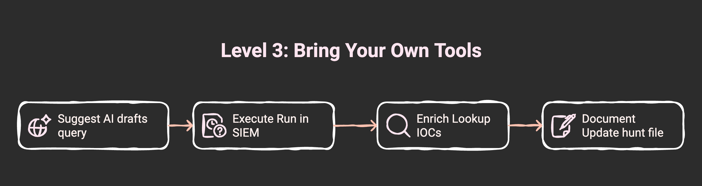

# Level 3: Generative Capabilities - MCP Examples

At Level 3, your AI assistant can execute queries, enrich findings, and interact with your security stack via MCP (Model Context Protocol) servers.

**The key difference:** AI doesn't just suggest queries—it runs them with your tools.

## Introduction to MCP Servers

MCP servers let Claude interact with your security tools:

- **SIEM search** (Splunk, Elastic, Chronicle)
- **Endpoint data** (CrowdStrike, SentinelOne, Microsoft Defender)
- **Ticket creation** (Jira, ServiceNow, GitHub Issues)
- **Threat intel queries** (MISP, VirusTotal, AlienVault OTX)

**Level 3 is "Bring Your Own Tools"** - you connect MCP servers for whatever tools you already use.



## Example MCP Integrations

### Available MCPs

- **Splunk:** Execute hunt queries, retrieve results (official MCP available)
- **CrowdStrike:** Query endpoint telemetry (official MCP available)
- **Jira:** Auto-create incident tickets (official MCP available)
- **Your tools:** Find MCPs for your specific security stack

**Full catalog:** [integrations/MCP_CATALOG.md](../integrations/MCP_CATALOG.md)

---

## Example 1: SIEM Query Execution

### Without MCP (Level 2)

```
You: "Search for SSH brute force attempts"

Claude: "Here's a Splunk query:
index=linux_secure action=failure
| stats count by src_ip
| where count > 20"

You: [Copies query to Splunk, runs it, pastes results back]

Claude: "I see 3 high-volume IPs. Let me analyze them..."
```

**Problems:**

- Manual copy-paste workflow
- Context switching between tools
- Delays in getting results
- No automatic enrichment

### With Splunk MCP (Level 3)

```
You: "Search for SSH brute force attempts"

Claude: [Executes Splunk query via MCP]
"Found 3 source IPs with high failure rates:
- 203.0.113.45 (127 attempts)
- 198.51.100.22 (89 attempts)
- 192.0.2.15 (67 attempts)

Let me check CrowdStrike for detections..."

[Queries CrowdStrike MCP]

"203.0.113.45 connected to 3 hosts with Qakbot detections.

Should I create a Jira ticket for investigation?"
```

**Benefits:**

- No manual copying
- Automatic tool chaining
- Instant results
- Enrichment without asking

---

## Example 2: Multi-MCP Workflow

Run an entire hunt end-to-end across multiple tools.

### Scenario: Execute Hunt H-0042

```
You: "Execute hunt H-0042"

Claude:
1. [Reads H-0042.md hypothesis file]
   "Hunt H-0042 targets lateral movement via PowerShell remoting (T1028).
   Data sources: Sysmon (Event ID 3), Windows Event Logs (Event ID 4624)"

2. [Splunk MCP] Executes detection query
   index=sysmon EventCode=3 Image="*powershell.exe"
   | stats dc(DestinationHostname) as targets by User, Computer
   | where targets > 5

   Results:
   - svc_backup: 12 unique targets
   - itadmin-temp: 7 unique targets
   - domain_admin: 15 unique targets

3. [CrowdStrike MCP] Validates suspicious hosts
   "Checking EDR telemetry for these accounts..."

   Findings:
   - svc_backup: Legitimate backup automation (known FP)
   - itadmin-temp: Suspicious - executed from workstation, not jump server
   - domain_admin: Legitimate admin activity

4. [VirusTotal MCP] Checks reputation of accessed hosts
   "All destination IPs have clean reputation"

5. [Jira MCP] Creates incident ticket
   "Created SEC-1547: Suspicious lateral movement by itadmin-temp
   - Account: itadmin-temp
   - Source: WS-DEV-042
   - Targets: 7 hosts in production network
   - Priority: High
   - Assigned to: Security Operations"

6. [Git operations] Updates hunt file
   "Updated H-0042.md with execution results and committed changes"

Final summary:
"Hunt completed in 2 minutes:
- 9 suspicious events found
- 1 confirmed suspicious account (itadmin-temp)
- 2 known false positives filtered
- 1 incident ticket created (SEC-1547)
- Hunt file updated with results"
```

### What Just Happened

Claude autonomously:

1. ✅ Read the hunt hypothesis
2. ✅ Executed queries across multiple tools
3. ✅ Enriched findings with threat intel
4. ✅ Filtered known false positives
5. ✅ Created a ticket with full context
6. ✅ Documented results in the hunt file

**Time saved:** 45 minutes of manual work → 2 minutes with MCP

---

## Example 3: Threat Intel Enrichment

### Enriching IOCs Automatically

```
You: "Check these IPs for reputation:
203.0.113.45, 198.51.100.22, 192.0.2.15"

Claude: [Queries VirusTotal MCP for each IP]

"Results:
1. 203.0.113.45
   - VirusTotal: 12/89 vendors flagged (malicious)
   - Categories: Botnet C2, Qakbot
   - First seen: 2024-11-15
   - Recommendation: Block immediately

2. 198.51.100.22
   - VirusTotal: 0/89 vendors flagged (clean)
   - No threat intelligence matches
   - Recommendation: Monitor

3. 192.0.2.15
   - VirusTotal: 3/89 vendors flagged (suspicious)
   - Categories: Port scanning
   - First seen: 2024-11-28
   - Recommendation: Investigate further

Should I create firewall block rules for 203.0.113.45?"
```

### Enrichment During Hunts

```
You: "Execute H-0089 and enrich all findings with threat intel"

Claude: [Runs hunt query via Splunk MCP]
"Found 15 suspicious connections.
Enriching with VirusTotal..."

[Automatically queries VirusTotal for each IOC]

"After enrichment:
- 3 confirmed malicious (Qakbot C2)
- 8 clean (false positives)
- 4 suspicious (investigating further)

Created 3 high-priority tickets for confirmed threats."
```

---

## Example 4: Creating Tickets with Context

### Manual vs. Automated Ticket Creation

**Without MCP:**

1. Run hunt query in Splunk
2. Copy results
3. Open Jira
4. Fill out ticket manually
5. Attach evidence
6. Assign and prioritize

**Time:** ~10 minutes per ticket

**With Jira MCP:**

```
You: "Create a ticket for the itadmin-temp lateral movement finding"

Claude: [Creates Jira ticket via MCP]
"Created SEC-1547: Suspicious Lateral Movement

Summary: Account itadmin-temp executed PowerShell remoting to 7 production hosts

Description:
**Hunt:** H-0042 (Lateral Movement via PowerShell Remoting)
**Technique:** T1028 (Windows Remote Management)
**Account:** itadmin-temp
**Source Host:** WS-DEV-042
**Target Hosts:** 7 production servers
**Timeframe:** 2024-11-29 14:23 - 14:45 UTC

**Evidence:**
- PowerShell remoting from non-jump-server workstation
- Targets include production database servers
- No prior history of admin activity from this account

**Splunk Query:**
index=sysmon EventCode=3 User="itadmin-temp" Image="*powershell.exe"

**Recommendation:**
1. Disable account pending investigation
2. Review session activity on target hosts
3. Check for privilege escalation or data exfiltration

**Priority:** High
**Assigned:** security-operations
**Labels:** lateral-movement, T1028, powershell"
```

**Time:** 30 seconds with full context

---

## Getting Started with Level 3

### Step 1: Choose Your First MCP

Start with the tool you use most:

1. Browse [integrations/MCP_CATALOG.md](../integrations/MCP_CATALOG.md)
2. Look for official MCPs from tool vendors
3. Check community MCPs for popular tools

### Step 2: Follow the Quickstart

Each tool has a quickstart guide:

- [Splunk Quickstart](../integrations/quickstart/splunk.md)
- [CrowdStrike Quickstart](../integrations/quickstart/crowdstrike.md)
- [Jira Quickstart](../integrations/quickstart/jira.md)

### Step 3: Test Basic Operations

Verify your MCP works:

```
# Test Splunk MCP
You: "Search index=winlogs for failed logins in the past hour"

# Test CrowdStrike MCP
You: "List detections on host WS-DEV-042"

# Test Jira MCP
You: "Create a test ticket"
```

### Step 4: Run Your First Hunt

Execute a simple hunt end-to-end:

```
You: "Run hunt H-0001 using the Splunk MCP"

Claude: [Executes query, analyzes results, creates tickets if needed]
```

### Step 5: Add More MCPs

Once you're comfortable with one MCP, add more:

- Add threat intel (VirusTotal, MISP)
- Add ticketing (Jira, ServiceNow)
- Add additional SIEMs or EDR platforms

---

## Success Criteria for Level 3

You're successfully at Level 3 when:

- ✅ Claude **executes** hunt queries instead of just writing them
- ✅ IOCs are **enriched** automatically with threat intel
- ✅ Incident tickets are **created** with full context
- ✅ You focus on **analysis and decision-making**, not manual tasks
- ✅ Hunt execution time is reduced by 60-80%

---

## Learn More

- **MCP Catalog:** [integrations/MCP_CATALOG.md](../integrations/MCP_CATALOG.md)
- **Quickstart Guides:** [integrations/quickstart/](../integrations/quickstart/)
- **Integration Documentation:** [integrations/README.md](../integrations/README.md)
- **Maturity Model:** [maturity-model.md](maturity-model.md)

**Ready for Level 4?** See [level4-agentic-workflows.md](level4-agentic-workflows.md) for autonomous agent patterns.
