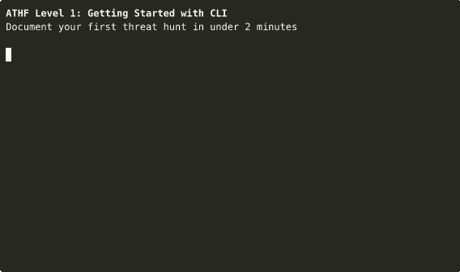

# Recording Level 1 CLI Demo

This guide walks through recording a GIF demo of ATHF Level 1.

## Prerequisites

```bash
# Install asciinema (for recording)
brew install asciinema

# Install agg (for converting to GIF)
brew install agg
```

## Quick Recording

```bash
cd scripts/

# Record the demo (will auto-play the script)
asciinema rec -c "./demo-level1.sh" athf-level1-demo.cast

# Convert to GIF (optimized settings)
agg --speed 1.0 --theme monokai athf-level1-demo.cast ../assets/athf-level1-demo.gif
```

## Terminal Setup (Optional)

For the cleanest recording:

1. **Terminal size:** 120x30 (wide enough for content, not too tall)
   ```bash
   # Set before recording
   printf '\e[8;30;120t'
   ```

2. **Clean prompt:**
   ```bash
   export PS1="\$ "
   ```

3. **Clear terminal:**
   ```bash
   clear
   ```

## Recording Options

### Standard Recording (Recommended)
```bash
asciinema rec -c "./demo-level1.sh" athf-level1-demo.cast
```

### With Idle Time Limit (Faster Playback)
```bash
asciinema rec --idle-time-limit 2 -c "./demo-level1.sh" athf-level1-demo.cast
```

## GIF Conversion Options

### High Quality (Larger File)
```bash
agg --speed 1.0 --theme monokai --font-size 14 athf-level1-demo.cast athf-level1-demo.gif
```

### Optimized (Smaller File)
```bash
agg --speed 1.2 --theme monokai --font-size 12 athf-level1-demo.cast athf-level1-demo.gif
```

### Fast Demo (Quick Overview)
```bash
agg --speed 1.5 --theme monokai --font-size 12 athf-level1-demo.cast athf-level1-demo-fast.gif
```

## Themes Available

- `monokai` (Recommended - good contrast)
- `solarized-dark`
- `dracula`
- `nord`
- `asciinema` (Classic terminal look)

Test different themes:
```bash
agg --theme dracula athf-level1-demo.cast test-dracula.gif
agg --theme nord athf-level1-demo.cast test-nord.gif
```

## Editing the Cast File

If you need to edit timing or content:

```bash
# Open the .cast file in a text editor
# It's JSON - you can adjust timestamps manually
code athf-level1-demo.cast
```

## Final Output Location

Place the final GIF in:
```
assets/athf-level1-demo.gif
```

Then reference it in documentation:
```markdown

```

## Tips

1. **Test first:** Run the script manually to see timing
2. **Terminal size matters:** Keep it consistent (120x30 works well)
3. **Speed:** `1.0` = real-time, `1.5` = 50% faster (good for demos)
4. **Font size:** `12` for embeds, `14` for standalone viewing
5. **File size:** Aim for under 5MB for GitHub (use `--speed 1.2` if too large)

## Troubleshooting

**GIF too large?**
- Increase `--speed` (1.5 or 2.0)
- Reduce `--font-size` (10 or 11)
- Trim idle time with `--idle-time-limit 1`

**Text too small?**
- Increase `--font-size` to 14 or 16
- Reduce terminal width (100 columns instead of 120)

**Wrong colors?**
- Try different `--theme` options
- `monokai` and `dracula` have best contrast

## Complete Workflow

```bash
# 1. Setup
cd /Users/sydney/work/agentic-threat-hunting-framework/scripts
export PS1="\$ "
printf '\e[8;30;120t'
clear

# 2. Record
asciinema rec --idle-time-limit 2 -c "./demo-level1.sh" athf-level1-demo.cast

# 3. Preview (optional)
asciinema play athf-level1-demo.cast

# 4. Convert to GIF
agg --speed 1.2 --theme monokai --font-size 12 athf-level1-demo.cast ../assets/athf-level1-demo.gif

# 5. Check file size
ls -lh ../assets/athf-level1-demo.gif

# 6. Clean up (optional)
rm athf-level1-demo.cast
```

## What This Demo Shows

The Level 1 demo demonstrates:
1. ✓ `athf init` - Initialize workspace
2. ✓ `athf hunt new` - Create hunts (2 examples)
3. ✓ `athf hunt validate` - Validate structure
4. ✓ `athf hunt list` - View catalog

Total runtime: ~30 seconds (with --speed 1.2)
