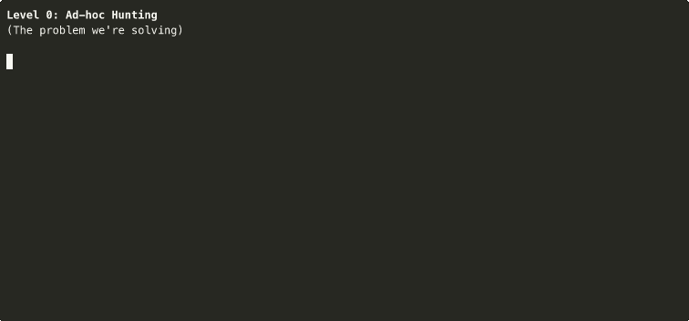

# Recording the 5 Maturity Levels

This guide shows how to create GIFs for each maturity level, highlighting the progression from ad-hoc to autonomous.

## Overview

Each level demonstrates the progression from ad-hoc to autonomous threat hunting:

| Level | Script | Story | Runtime | Key Difference |
|-------|--------|-------|---------|----------------|
| **0** | `demo-level0-adhoc.sh` | Scattered notes about macOS stealers | ~20s | Chaos - no memory |
| **1** | `demo-level1.sh` | You create H-0005 manually | ~30s | Structure - you document |
| **2** | `demo-level2-searchable.sh` | AI recalls hunts, suggests coverage gaps | ~35s | Memory - AI reads & suggests |
| **3** | `demo-level3-generative.sh` | AI generates H-0005 (T1567) with 8 queries | ~45s | Automation - AI creates hunts |
| **4** | `demo-level4-agentic.sh` | Agents create H-0008 (Notes.app) overnight | ~35s | Autonomy - agents work 24/7 |

**The Progression:**
- **Level 0:** "Check unsigned processes" lost in notebook
- **Level 1:** Create H-0005 (Exfiltration Over Web Service) with LOCK structure
- **Level 2:** AI analyzes coverage, suggests what to hunt next
- **Level 3:** AI generates H-0005 (T1567 exfiltration) with complete hunt plan
- **Level 4:** Agents monitor threat intel, create H-0008 (Notes.app) based on patterns

## Quick Record All Levels

```bash
cd /Users/sydney/work/agentic-threat-hunting-framework/scripts

# Record each level
for level in 0 2 3 4; do
  asciinema rec --idle-time-limit 2 \
    -c "./demo-level${level}*.sh" \
    athf-level${level}.cast

  agg --speed 1.2 --theme monokai --font-size 12 \
    athf-level${level}.cast \
    ../assets/athf-level${level}.gif
done

# Level 1 already exists from earlier
```

## Individual Recording

### Level 0: Ad-hoc (The Problem)

**Purpose:** Show the chaos without ATHF

```bash
# Record
asciinema rec --idle-time-limit 2 -c "./demo-level0-adhoc.sh" athf-level0.cast

# Convert
agg --speed 1.2 --theme monokai --font-size 12 \
  athf-level0.cast \
  ../assets/athf-level0.gif
```

**What it shows:**
- Slack: "Did we check for macOS info stealers?"
- Scattered notes: unsigned processes, Safari queries, lost emails
- No one remembers what was done
- Detection logic exists only in analyst's head

**Key message:** "macOS stealer investigation - lost to chaos"

---

### Level 1: Documented Hunts

**Purpose:** Manual but structured

```bash
# Already created as demo-level1.sh
asciinema rec --idle-time-limit 2 -c "./demo-level1.sh" athf-level1.cast

agg --speed 1.2 --theme monokai --font-size 12 \
  athf-level1.cast \
  ../assets/athf-level1.gif
```

**What it shows:**
- `athf init` - Initialize workspace
- `athf hunt new` - Create H-0005 (Exfiltration Over Web Service)
- View hunt metadata matching your image
- `athf hunt validate` - Ensure consistency
- `athf hunt list` - View H-0005 in catalog

**Key message:** "H-0005 now persists with full context - never lost again"

---

### Level 2: Searchable Memory

**Purpose:** AI reads your hunts and provides context

```bash
# Record
asciinema rec --idle-time-limit 2 -c "./demo-level2-searchable.sh" athf-level2.cast

# Convert
agg --speed 1.2 --theme monokai --font-size 12 \
  athf-level2.cast \
  ../assets/athf-level2.gif
```

**What it shows:**
- You ask: "What do we know about macOS stealers?"
- AI finds H-0001 automatically
- AI recalls: Atomic Stealer detected, query refined, detection deployed
- AI suggests: "Extend to Firefox/Brave (mentioned in H-0001 next steps)"
- AI reads your environment from AGENTS.md

**Key message:** "AI recalls H-0001 instantly, suggests building on it"

---

### Level 3: Generative Capabilities

**Purpose:** AI executes queries via MCP tools

```bash
# Record
asciinema rec --idle-time-limit 2 -c "./demo-level3-generative.sh" athf-level3.cast

# Convert
agg --speed 1.2 --theme monokai --font-size 12 \
  athf-level3.cast \
  ../assets/athf-level3.gif
```

**What it shows:**
- MCP capabilities: SIEM, EDR, ticketing, hunt updates
- You ask: "what other exfil techniques can i hunt"
- AI analyzes hunt-vault coverage, identifies gaps
- AI suggests T1567 (Exfiltration Over Web Service) with 4 sub-techniques
- You say: "hunt for T1567 - Exfiltration Over Web Service"
- AI generates H-0005 with all sub-techniques covered
- AI creates 8 prioritized hunting queries ready to execute
- Shows shift from "copy-paste between 5 tools" to "ask and validate"

**Key message:** "AI generates complete hunt plans from a single request"

---

### Level 4: Agentic Workflows

**Purpose:** Autonomous agents working 24/7

```bash
# Record
asciinema rec --idle-time-limit 2 -c "./demo-level4-agentic.sh" athf-level4.cast

# Convert
agg --speed 1.2 --theme monokai --font-size 12 \
  athf-level4.cast \
  ../assets/athf-level4.gif
```

**What it shows:**
- [02:15 AM] CTI agent finds threat intel: Atomic Stealer v2.3 targets Notes.app
- [02:16 AM] Validator checks H-0001 patterns can be reused
- [02:17 AM] Query generator adapts H-0001 query for Notes.app
- [02:19 AM] Analyzer finds 2 infections, creates tickets
- [02:20 AM] Documentation agent creates H-0008 (references H-0001)
- [08:00 AM] You arrive to Slack summary: H-0008 complete, detection extended

**Key message:** "Agents build on H-0001 overnight - autonomous evolution"

---

## Side-by-Side Comparison

Hunt capability progression through each level:

| Level | Who Acts | What Happens | Result |
|-------|----------|--------------|--------|
| **0** | You | Hunt for macOS stealers → notes lost | No memory, redundant work |
| **1** | You | Create H-0005 manually with CLI | Hunt persists, structured |
| **2** | AI + You | AI recalls past hunts → suggests coverage gaps | Instant context, no re-research |
| **3** | AI for you | AI generates H-0005 (T1567) with 8 queries via MCP | Complete hunt planning automation |
| **4** | Autonomous | Agents create H-0008 (Notes.app) based on patterns | 24/7 evolution |

## GIF Placement in Docs

### In maturity-model.md:

```markdown
## Level 0: Ad-hoc



Problems: No memory, redundant work, lost context

---

## Level 1: Documented Hunts


You create hunts manually using CLI or markdown

---

## Level 2: Searchable Memory


AI reads your hunts and provides context-aware suggestions

---

## Level 3: Generative Capabilities


AI executes queries and creates tickets via MCP tools

---

## Level 4: Agentic Workflows


Autonomous agents monitor CTI and run hunts 24/7
```

## Terminal Settings

**Optimal for these demos:**
```bash
# Consistent size across all levels
printf '\e[8;30;100t'  # 30 rows × 100 columns

# Clean prompt
export PS1="\$ "
```

## Theme Recommendations

- **Level 0 (Problem):** `monokai` - dark, serious
- **Level 1 (Manual):** `monokai` - consistent
- **Level 2 (AI-assisted):** `monokai` or `dracula` - friendly
- **Level 3 (Generative):** `monokai` - professional
- **Level 4 (Agentic):** `monokai` or `nord` - futuristic

## Batch Processing

Record all levels at once:

```bash
#!/bin/bash
cd /Users/sydney/work/agentic-threat-hunting-framework/scripts

# Setup
export PS1="\$ "
printf '\e[8;30;100t'

LEVELS=(
  "level0-adhoc:Level 0"
  "level1:Level 1"
  "level2-searchable:Level 2"
  "level3-generative:Level 3"
  "level4-agentic:Level 4"
)

for level_info in "${LEVELS[@]}"; do
  IFS=: read -r script_name display_name <<< "$level_info"

  echo "Recording ${display_name}..."

  asciinema rec --idle-time-limit 2 \
    -c "./demo-${script_name}.sh" \
    "athf-${script_name}.cast"

  agg --speed 1.2 --theme monokai --font-size 12 \
    "athf-${script_name}.cast" \
    "../assets/athf-${script_name}.gif"

  rm "athf-${script_name}.cast"

  echo "✓ ${display_name} complete"
done

echo ""
echo "All level demos recorded!"
ls -lh ../assets/athf-level*.gif
```

## File Size Targets

- **Level 0:** < 2MB (short, text-heavy)
- **Level 1:** < 4MB (moderate)
- **Level 2:** < 4MB (conversation-focused)
- **Level 3:** < 5MB (step-by-step execution)
- **Level 4:** < 4MB (time-lapse style)

## Testing

Preview each script before recording:

```bash
./demo-level0-adhoc.sh
./demo-level1.sh
./demo-level2-searchable.sh
./demo-level3-generative.sh
./demo-level4-agentic.sh
```

## What Makes Each Level Unique

**Level 0:** Shows the pain - chaos without structure
**Level 1:** Shows the solution - manual but persistent
**Level 2:** Shows the amplification - AI reads and suggests
**Level 3:** Shows the automation - AI executes
**Level 4:** Shows the vision - autonomous operation

The progression tells a story: manual → assisted → automated → autonomous

## The Narrative Arc (Threat Hunting Evolution)

**Act 1 (Level 0):**
*The Problem* - Investigations scattered across Slack, notebooks, emails. No one knows what was tested. No memory, no structure.

**Act 2 (Level 1):**
*The Solution* - You create H-0005 using `athf hunt new --technique T1567`. Documented with LOCK structure, YAML metadata showing Date, Hunter, Platform, Data Sources. Knowledge persists.

**Act 3 (Level 2):**
*The Amplification* - You ask what to hunt next. AI recalls past hunts in seconds, analyzes coverage gaps. AI suggests multiple techniques. 20 minutes → 5 seconds.

**Act 4 (Level 3):**
*The Automation* - You say "hunt for T1567 - Exfiltration Over Web Service". AI generates complete H-0005 with all 4 sub-techniques, 8 prioritized queries, ready to execute via MCP. Complete hunt planning automated.

**Act 5 (Level 4):**
*The Autonomy* - While you sleep, agents monitor threat intel. Agent finds Atomic Stealer v2.3 targets Notes.app. Agents validate against H-0001, adapt queries, execute hunt, find 2 infections, create H-0008, commit. You arrive to Slack summary.

**The transformation:** From chaos → structure → memory → automation → autonomy

All powered by one principle: **persistent, AI-readable hunt documentation**
